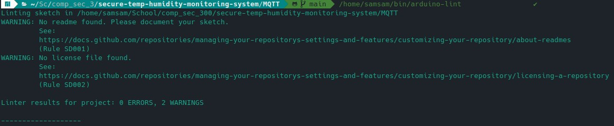

# Secure Temperature/Humidity Measurement System

A comprehensive solution for everyday temperature and humidity logging needs, secure and reliable :) Try this at home!

## Structure

1. [Hardware Requirements](#hardware-requirements)
2. [Architecture](#architecture)
3. [Installation Guide](#installation-guide)
   - [Certificate Generation for Secure Communication](#certificate-generation-for-secure-communication)
   - [ESP8266 Installation and MQTT.ino Modifications](#esp8266-installation-and-mqttino-modifications)
   - [Running the Central Server](#running-the-central-server)
4. [Security Features and Implementations](#security-features-and-implementations)
5. [Security Verification of the Tools and Frameworks](#security-verification-of-the-tools-and-frameworks)
6. [Additional ideas](#additional-ideas)
7. [Usage of AI and internet sources](#usage-of-ai-and-internet-sources)

## 1. Hardware Requirements
For running this marvelous system you need following components:
 - DHT11 / DHT22 (or any sensor if you are up for some tinkering and modifying the code)
 - Esp8266 board, Wemos family devices are tested to be working great. (You may bring your own other wifi based boards but again some tinkering is required)
 - A machine that can act as server. A raspberry pi or any linux will do great, but do **NOT** use windows here since they are rubbish.

 That's basically everything you need. Ready for an adventure? 

## 2. Architecture
Following figure presents system's architecture:


## 3. Installation Guide


#### Generate and self sign root CA for all of your certificates

To generate and self sign the root CA for all of your certificates, follow these steps:

1. Open a terminal or command prompt.
2. Navigate to the directory where you want to generate the root CA certificate.
3. Run the following command to generate the root CA private key:
   ```
   openssl genrsa -out yourRootCAKey.pem 4096
   ```
4. Run the following command to generate the root CA certificate:
   ```
   openssl req -x509 -sha256 -new -nodes -key yourRootCAKey.pem -days 3650 -out yourRootCACert.pem
   ```
   You may adjust the values to your needs
5. Fill in the required information for the root CA certificate, such as country name, state or province name, locality name, organizational unit name, and common name.

6. The root CA certificate will be generated and saved as `yourRootCACert.pem` in the current directory.

#### Generate configuration to easily store your certificate information:
store following in ssl.conf
```
[req]
distinguished_name = req_distinguished_name
req_extensions = v3_req

[req_distinguished_name]
countryName = <your input here>
countryName_default = <your input here>
stateOrProvinceName = <your input here>
stateOrProvinceName_default = <your input here>
localityName = <your input here>
localityName_default = <your input here>
organizationalUnitName = <your input here>
organizationalUnitName_default = <your input here>
commonName = <your input here>
commonName_max = 64

[ v3_req ]
# Extensions to add to a certificate request
basicConstraints = CA:FALSE
keyUsage = nonRepudiation, digitalSignature, keyEncipherment
subjectAltName = @alt_names
[alt_names]
DNS.1   = <your input here>
IP.1 	= <your input here>

```
Note: Make sure to replace `<your input here>` with the actual values for the certificate information.

#### Generate the mosquitto certificate

To generate keys for the mosquitto certificate, follow these steps:

1. Open a terminal or command prompt.
2. Navigate to the directory where you want to generate the mosquitto certificate.
3. Run the following command to generate the private key:
   ```
   openssl genrsa -out mosquitto.key 4096
   ```

4. Run the following command to generate the certificate signing request (CSR) using the provided configuration file:
   ```
   openssl req -out mosquitto.csr -key mosquitto.key -config ssl.conf -new
   ```
5. The private key will be generated and saved as `mosquitto.key` in the current directory, and the CSR will be saved as `mosquitto.csr`.

6. Use the CSR to obtain a signed certificate from a certificate authority (CA) or self-sign the certificate using the root CA generated earlier:
```
sudo openssl x509 -req -days 3650 -in mosquitto.csr -CA yourRootCACert.pem -CAkey yourRootCAKey.pem -out mosquitto.crt -extensions v3_req -extfile ssl.conf
```
7. Once you have the signed certificate, save it as `mosquitto.crt` in the same directory. 

8. Add your certificates to ``mosquitto/certs`` folder

***HINT:*** These steps can also be applied in granafana certificate creation, just change domain names, ip and ceritificate details in ssl.conf accordingly

### ESP8266 Installation and MQTT.ino Modifications
NOTE: You have to have working arduino program installed to complete the following steps, if you do not have please install it.

To install ESP8266 and modify MQTT.ino for the system, follow these instructions:

1. Install the ESP8266 board:
   - Open the Arduino IDE.
   - Go to **File > Preferences**.
   - In the "Additional Boards Manager URLs" field, enter the following URL:
     ```
     http://arduino.esp8266.com/stable/package_esp8266com_index.json
     ```
   - Click **OK** to save the preferences.
   - Go to **Tools > Board > Boards Manager**.
   - Search for "esp8266" and install the ESP8266 board.

2. Install dependecies you need:
   - Go through required components and search from arduino store and install

3. Modify MQTT.ino:
   - Open the MQTT.ino file in the Arduino IDE.
   - Update the necessary configurations such as Wi-Fi credentials, MQTT broker address, and topic.
   - Change your certificate's SHA1 checksum to the field = This enables your sensor to trust the broker
   - Make any other modifications required for your specific setup.

4. Upload the code to the ESP8266 board:
   - Connect the ESP8266 board to your computer.
   - Select the appropriate board and port from the **Tools** menu.
   - Click the **Upload** button to upload the modified code to the ESP8266 board.

### Running the Central Server
This server can be ran on any linux distro, For running the server you need to do the following:
- Update environment variables in .env file

- Install Docker Compose: Docker Compose is included in Docker Desktop for Windows and Mac. For Linux, you can download it from Docker's GitHub repository. You can check if it's installed correctly by running `docker compose --version` in your terminal. 

- Run the docker compose with `docker compose up`

- Test that Gradfan is running at: ``locahost:3000``

- Grafana has not been configured with any users by default, you may log in using insecure default: username `admin` and password `admin` these need to be changed for maxium security. 

NOTES:

- Mosquitto has a weak default password and one weak ``test_user`` with a simple password `pw`, these credentials need to be inserted in .env file 
- Central server can be tested by sending manually requests to mqtt using terminal
- Certificates **NEED TO BE** in place, otherwise the docker compose will not complete


### BYOP - Bring your own (reverse)proxy

I assume that if you have found your way into this point of the guide and are still alive you know how to setup your own reverse proxy. If you don't here are couple of tips how to do that. And please generate certificates for the grafana GUI to use it over HTTPS otherwise all the hard work of securing the traffic is useless 

- [Google](#https://www.google.com) For general instructions how to setup a proxy like Nginx
- You can copy the example (and secure) nginx configuration file from the central_server_nginx_config -> /etc/nginx/sites-enabled at the server
- For ease of access it might be a good idea to setup a DNS server so accessing your instace is a lot easier

NOTE: This step is not mandatory, but extremely recomended

## 4. Security Features and Implementations
The system has many levels of security. Majority of the security relies on the encryption of the data and certificates. The system implements the following security features:

- **Encryption in MQTT:** All data transmitted over MQTT between the sensors and the central server is encrypted using SSL and certificates, ensuring secure communication over TLS 1.2.
- **Authentication:** The system uses authentication mechanisms to verify the identity of the sensors and the central server, preventing unauthorized access.
- **Access Control (Server):** Access to the central server is restricted to authorized users only with password protected public-keys, ensuring that only authorized personnel can view and manage the collected data. Usage over internet has been implemented by accessing the central server over VPN (wireguard) only. 
- **Access Control (Grafana):** Access to the Grafana is restricted to authorized and restricted users only, ensuring that only persons with correct priviledges can view the data. No admins or superusers in use
- **Certificate Generation:** The repository provides a step-by-step guide for generating SSL certificates to enable secure communication on your deployed instace. Additionally you may fetch your free certificate from [Let's encrypt](https://letsencrypt.org/) if you have a domain name in your posession
- **Countermeasures against CSRF and other:** The nginx configuration provided is  used for setting HTTP response headers to enhance the security of your web application. These headers can help mitigate several types of attacks such as Cross-Site Scripting (XSS), Cross-Site Request Forgery (CSRF), Clickjacking, and others. 
#### Encryption from server to client.
The data is being sent over a secure connection:


And it uses our self signed and truested certficate:


These security features ensure that the temperature and humidity measurement system is secure and reliable, protecting the integrity and confidentiality of your temperature and humidity data from nasty neightbours.

#### Usage of linters to avoid vulnerable coding habbits:
For aduino part I used a tool called [arduino lint](https://arduino.github.io/arduino-lint/1.2/) which is a very good tool for lintering arduino code. This is especially impportant to use arduino specific linter since the syntax of arduino language differs from it's origin's C++ syntax. 

From the latest and most updates version we can observe that no errors were found. Related warnings were related mostly to

Python code was reformatted using black, to follow latest coding standards and prevent writing insecure code.

## 5. Security Verification of the Tools and Frameworks
For this project I have been using few frameworks and tools to enchance the deployability and overall quality.

**A security analysis of Docker in project**

Docker security is a critical aspect to consider when deploying containerized application like this. One of the key security features of Docker is container isolation. A pontential attacker cannot access the data or the executions of other containers nor the host system. Another important aspect of Docker security is image security. For that I have ensured that I will use docker images only from reputable sources. In addition, Docker provides secure networking options. I have configured network isolation between containers and only data input container (mosquitto) and exit point (grafana have open ports for external communication) These measures help protect against network-based attacks and eavesdropping. I have also implemented .env file to prevent data leakage throug github via docker containers.In conclusion, Docker can be used to improve overall security.

**A security analysis of Postgres in project**

PostgreSQL is an open-source object-relational database system that is widely used. When it comes to security aspects, PostgreSQL provides a variety of features. It supports several authentication methods, including password, GSSAPI, SSPI, SCRAM-SHA-256, and more. In this project, strong passwords are used and stored securely locally to ensure working authentication infrastructure. PostgreSQL has also a sophisticated role-based privilege system that allows the database owners to grant or revoke permissions to or from users. This feature is used to apply least privilege principle for different roles. PostgreSQL also supports column-level encryption for sensitive data, thgough this was not used in this project. Lastly, PostgreSQL has easy to use logging capabilities that can be used to track user activity and changes in to data. 

**A security analysis of Grafana in project**

Grafana is also an open-source platform. It is renowned for its rich data visualizations (also in this project). Grafana supports multiple forms of authentication, including OAuth, LDAP, and basic username/password (Used in this project due not using AD in home environments). In this project I have used, strong, unique passwords created with vaultvarden for maximal security and unpredictibility. Grafana also has a built-in role-based access control system that allows control over who can do what within the system, providing a possibility to do a viewer role for a smart mirror for example. Furthermore, Grafana is used over HTTPS and a proxy for secure data transmission. Additionally, Grafana and proxy are both colleting auditing logs that track user activity.

**A security analysis of Mosquitto in project**

Eclipse Mosquitto is an open-source (Once again) message broker that implements the MQTT protocol, which is used for machine-to-machine (M2M) communication in IoT applications. Mosquitto supports username/password authentication, and in this project, strong, unique passwords are used to ensure secure authentication of the users and the devices. Furthermore, Mosquitto supports SSL/TLS for secure communication from the sensors, ensuring the confidentiality and integrity of data in transit so neigbours cannot peek my data.

**Physical security of the devices**

Physical security is a crucial aspect of any system. As this project runs inside my home network and inside my own wall, I recall that the devices are as safe as any other property I have in my posession. The devices are not kept in a clean, dry, and cool environment as some of the sensors are to be placed in toilet room.

## 6. Additional ideas 

In the future as the system will expand more sensor can be added. This will be ideal for colleting data. At the moment the system is not supporting addition of new sensors but it is relatively configurable. 

Central server backup solution for the collected data would be a good idea to implement.

Securitywise new hardenings on the server could be implemented. These would include usage of more strict firewall rules, remove password access over SSH connections (Though password is quite secure), and adding more logging on the system events. 

## 7. Usage of AI and internet sources

I have used AI tools such as ChatGPT for few purposes in the project:

- **Brainstorm ideas:** What kind of frameworks are popular, what are the drawbacks of certain frameworks

- **Security consultation/brainstorming:** Is a certain configuration secure, simple threat modelling by asking questions about potential security risks in the contenxt of the environments

- **Documentation boilerplates:** Boilerplate for this document has been created with AI tools 

- **Explain technologies:** Asked to explain some concepts in order to learn, refreshen memory on certain topics.

For initial versions in the beginning of the project I have followed some internet tutorials how to setup TLS MQTT for example. 